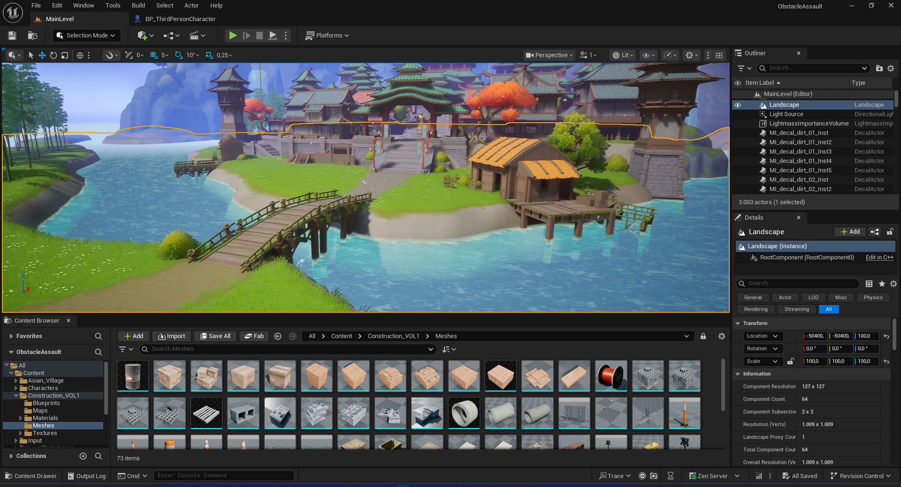

# Obstacle Assault



Projeto de estudo desenvolvido com **Unreal Engine 5.6**, combinando **sistemas criados em C++**, **integracao com Blueprints** e montagem de fases diretamente no editor da Unreal. O objetivo principal deste repositorio e servir como laboratorio pratico para explorar diferentes estilos de gameplay dentro de uma mesma base de codigo, exercitando desde movimentacao de personagem ate combate, inteligencia artificial, interacoes com cenario e construcao visual de niveis.

## Sobre o projeto

`Obstacle Assault` e um projeto focado em aprendizado e experimentacao, organizado para praticar recursos modernos da Unreal Engine com uma abordagem hibrida entre programacao e design de gameplay. Em vez de se limitar a uma unica mecanica, o projeto foi estruturado em variantes jogaveis que permitem testar solucoes diferentes para camera, movimentacao, ritmo de jogo, interacao com objetos e resposta do personagem as regras de cada fase.

Alem da parte tecnica, o projeto tambem valoriza a construcao de ambientes e o fluxo de navegacao do jogador. A cena apresentada no repositorio mostra um cenario montado dentro da Unreal com composicao de landscape, agua, arquitetura, materiais e organizacao de assets, reforcando que o estudo nao esta restrito apenas ao codigo, mas tambem ao processo completo de criacao dentro da engine.

## Utilizando Unreal Engine

O desenvolvimento foi feito utilizando a **Unreal Engine 5.6**, aproveitando a estrutura nativa da engine para separar regras de jogo, personagens, controladores, UI, atores interativos e variacoes de fase. O projeto tambem utiliza recursos importantes do ecossistema da Unreal para construir uma base mais proxima de um fluxo real de producao.

Entre os principais pontos trabalhados com a engine, estao:

- criacao e configuracao de personagens jogaveis
- montagem de fases e ambientacao no editor
- uso de `GameMode`, `PlayerController` e `Character`
- configuracao de interacoes com atores no mundo
- integracao com widgets de interface em `UMG`
- uso de sistemas de IA com `AIModule` e `StateTree`
- organizacao do conteudo em variantes de gameplay

## Create Blueprints

Os **Blueprints** entram como parte fundamental do fluxo de desenvolvimento do projeto. Eles sao utilizados para acelerar iteracoes, conectar comportamento visual com sistemas programados em C++ e permitir ajustes mais rapidos dentro do editor. Essa abordagem ajuda a manter a base tecnica mais robusta no codigo, enquanto detalhes de apresentacao, efeitos e eventos especificos podem ser refinados visualmente.

No projeto, os Blueprints aparecem como complemento direto da arquitetura em C++, por exemplo em:

- eventos implementaveis para UI e efeitos visuais
- configuracao de atores interativos
- movimentacao e comportamento complementar de plataformas
- resposta visual a dano, coleta e ativacao de objetos
- ajustes finos de personagens e parametros de gameplay

Essa combinacao deixa o projeto mais flexivel para estudo, porque permite entender na pratica onde vale a pena manter a logica no codigo e onde o Blueprint melhora a produtividade dentro da Unreal.

## Logica em C++

A logica principal do projeto foi organizada em **C++**, buscando uma estrutura mais escalavel e proxima do desenvolvimento profissional dentro da Unreal Engine. O codigo foi separado em modulos e variantes para que cada estilo de gameplay tenha suas proprias regras, personagens, controladores e sistemas de suporte.

Com base no conteudo atual da pasta `Source/`, o projeto inclui elementos como:

- variante de `Platforming` com personagem, dash e anim notify
- variante de `SideScrolling` com personagem, camera, pickups e plataformas
- variante de `Combat` com inimigos, dano, checkpoints e ativacao de combate
- plataformas moveis e obstaculos interativos
- controladores personalizados por modo de jogo
- interfaces para interacao, dano e ativacao
- widgets de interface para feedback ao jogador
- tarefas e utilitarios baseados em `StateTree` para IA

Essa organizacao torna o projeto especialmente interessante para estudo, porque mostra como diferentes mecanicas podem coexistir no mesmo repositorio sem misturar responsabilidades de forma desordenada.

## Tecnologias utilizadas

- `Unreal Engine 5.6`
- `C++`
- `Blueprints`
- `Enhanced Input`
- `UMG`
- `AIModule`
- `StateTreeModule`
- `GameplayStateTreeModule`

## Estrutura principal

```text
ObstacleAssault/
|- Config/
|- Content/
|- images/
|- Source/
|  |- ObstacleAssault/
|  |  |- Variant_Combat/
|  |  |- Variant_Platforming/
|  |  `- Variant_SideScrolling/
|  |- ObstacleAssault.Target.cs
|  `- ObstacleAssaultEditor.Target.cs
|- ObstacleAssault.uproject
`- README.md
```

## Como abrir o projeto

1. Clone este repositorio.
2. Abra o arquivo `ObstacleAssault.uproject` na Unreal Engine 5.6.
3. Caso necessario, gere os arquivos de projeto do Visual Studio.
4. Compile o projeto pelo Visual Studio 2022 ou diretamente pela Unreal.

## Requisitos

- `Unreal Engine 5.6`
- `Visual Studio 2022`
- workload `Desktop development with C++`

## Objetivos de estudo

Este projeto foi desenvolvido para praticar e consolidar conhecimentos em:

- logica de gameplay em C++
- integracao entre C++ e Blueprint
- movimentacao e controle de personagem
- criacao de variantes de jogo no mesmo projeto
- IA basica e intermediaria com `StateTree`
- uso de interfaces para organizar interacoes
- design de fases e construcao de ambientes
- interface de usuario com `UMG`

## Versionamento

O repositorio foi preparado para manter apenas os arquivos realmente necessarios ao desenvolvimento, evitando versionar conteudo gerado automaticamente pela Unreal Engine, como cache, arquivos intermediarios e configuracoes locais do editor.

## Autor

Desenvolvido por **Silvanei Martins**

- [LinkedIn](https://www.linkedin.com/in/silvanei-martins-a5412436)
- [Site Pessoal](https://silvaneimartins.com.br/)
- [GitHub](https://github.com/Store-Sam-Martins)
- Email: silvaneimartins_rcc@hotmail.com
- [YouTube](https://www.youtube.com/@silvaneimartins2487/featured)
- [X / Twitter](https://x.com/SilvaneiMartins)

Projeto desenvolvido para fins de estudo com foco em **Unreal Engine**, **Blueprints** e **logica em C++**.
